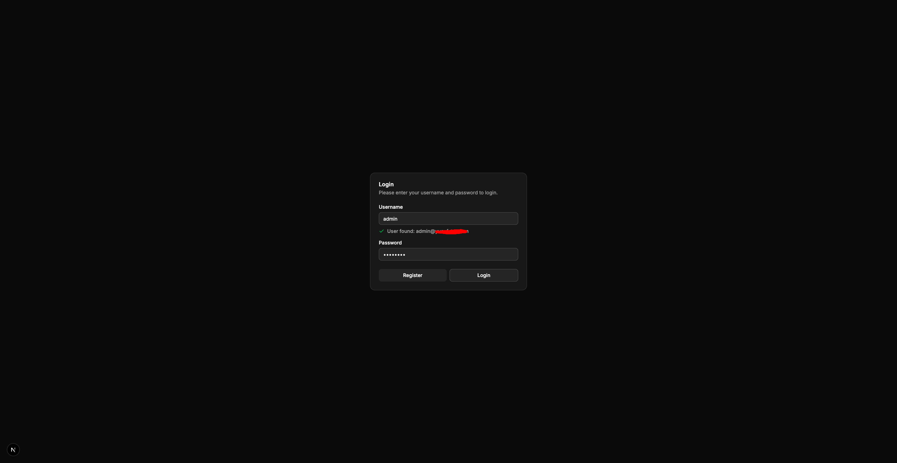
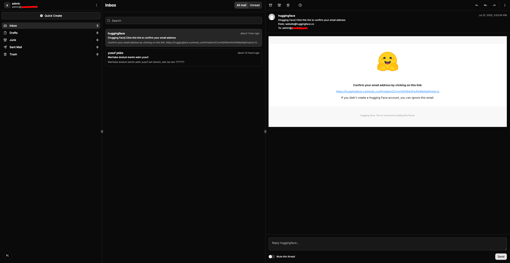
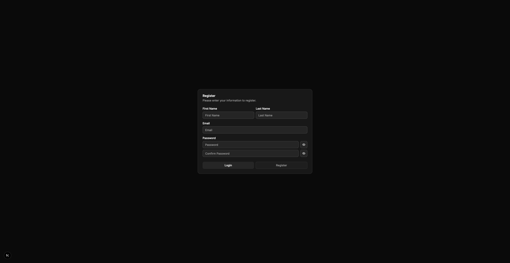

# Freedom - Complete Mail & DNS Management System

## 🎯 Project Overview

**Freedom** is a comprehensive, self-hosted email and DNS management platform that provides complete control over your digital communications infrastructure. Built with modern technologies and enterprise-grade components, it offers a fully independent solution for organizations and individuals who value privacy, security, and complete data sovereignty.

### 🏆 **Project Status**
- ✅ **DNS Server**: Complete and fully functional
- ✅ **Mail Server Infrastructure**: Complete and fully functional  
- ✅ **Admin Panel**: Complete and fully functional
- ✅ **Mail Client**: Complete and fully functional

---

## 🌟 Core Features

### 📧 **Professional Mail Infrastructure**
- **WildDuck Mail Server**: High-performance Node.js-based mail server with REST API
- **Haraka SMTP**: Advanced SMTP server with plugin architecture
- **ZoneMTA**: High-performance mail transfer agent
- **RSpamd**: Enterprise-grade spam filtering and email security
- **Multi-domain Support**: Unlimited domains and mailboxes
- **Advanced Security**: DKIM, SPF, DMARC, and TLS encryption
- **API Authentication**: X-Access-Token based authorization for secure API access

### 🌐 **DNS Management**
- **PowerDNS**: Authoritative DNS server with REST API
- **Zone Management**: Complete control over DNS zones and records
- **Real-time Updates**: Instant DNS propagation and management
- **Security Features**: DNSSEC support and advanced DNS security

### 🎛️ **Modern Admin Interface** ✅ Complete
- **Next.js 15 Admin Panel**: Beautiful, responsive management interface
- **Real-time Monitoring**: Live system metrics and container health
- **User Management**: Complete user account administration
- **DNS Management**: Intuitive DNS zone and record management
- **System Analytics**: Performance dashboards and usage statistics

### 📱 **Modern Mail Client** ✅ Complete
- **Next.js 15 Mail Client**: Modern, responsive webmail interface
- **Gmail-like Experience**: Familiar, intuitive email interface
- **Real-time Synchronization**: Instant email updates across devices
- **Advanced Search**: Powerful search with filters and operators
- **Resizable Panels**: Customizable layout with drag-and-drop
- **Dark/Light Theme**: Beautiful theme support with system preference detection
- **Account Switching**: Multi-account support with seamless switching
- **Message Threading**: Intelligent conversation grouping
- **Attachment Support**: Full file attachment handling
- **Rich Text Support**: HTML email rendering with security
- **Keyboard Shortcuts**: Power user keyboard navigation

---

## 🔧 Technology Stack

### Frontend (Complete) ✅
- **Next.js 15**: React framework with App Router and Turbopack
- **TypeScript 5.0**: Type-safe development
- **Tailwind CSS 4**: Utility-first CSS framework
- **Shadcn/ui**: Modern component library with Radix UI
- **React Query**: Data fetching and caching with TanStack Query
- **Framer Motion**: Smooth animations and transitions
- **React Hook Form**: Form handling with Zod validation
- **Jotai**: State management
- **Zustand**: Lightweight state management
- **Lucide React**: Beautiful icons
- **Tabler Icons**: Additional icon set
- **DOMPurify**: XSS protection for HTML content
- **Date-fns**: Date manipulation utilities
- **Lodash**: Utility functions
- **Sonner**: Toast notifications

### Backend (Complete) ✅
- **WildDuck**: High-performance mail server
- **PowerDNS**: Authoritative DNS server
- **Haraka**: SMTP server with plugins
- **ZoneMTA**: Mail transfer agent
- **RSpamd**: Anti-spam and security

### Infrastructure (Complete) ✅
- **Docker**: Containerization platform
- **Traefik**: Reverse proxy and load balancer
- **MongoDB**: Document database
- **Redis**: Caching and session storage
- **MySQL**: DNS data storage

### Security (Complete) ✅
- **Let's Encrypt**: SSL certificate automation
- **DKIM/SPF/DMARC**: Email authentication
- **TLS 1.3**: Transport layer security
- **Helmet**: Security middleware

---

## 🌐 Port Configuration

### DNS Services
| Service | Port | Protocol | Description |
|---------|------|----------|-------------|
| PowerDNS | 53 | TCP/UDP | DNS queries |
| PowerDNS API | 8081 | TCP | REST API |
| MySQL | 3306 | TCP | DNS database |
| Nginx | 8090 | TCP | HTTP proxy |
| Nginx SSL | 8443 | TCP | HTTPS proxy |

### Mail Services
| Service | Port | Protocol | Description |
|---------|------|----------|-------------|
| Haraka SMTP | 25 | TCP | SMTP server |
| WildDuck API | 8080 | TCP | Mail API |
| MongoDB | 27017 | TCP | Mail database |
| Redis | 6379 | TCP | Cache/session |

### Admin & Client
| Service | Port | Protocol | Description |
|---------|------|----------|-------------|
| Admin Panel | 3001 | TCP | Next.js admin |
| Mail Client | 3000 | TCP | Next.js client |
| Monitoring API | 8082 | TCP | System metrics |
| Traefik | 80/443 | TCP | Load balancer |

---

## 🔒 Security Features

### Email Security
- **DKIM (DomainKeys Identified Mail)**: Digital signatures for email authentication
- **SPF (Sender Policy Framework)**: Prevents email spoofing
- **DMARC (Domain-based Message Authentication)**: Email authentication policy
- **TLS 1.3**: Transport layer security for encrypted communication
- **RSpamd**: Advanced spam filtering and threat detection
- **DOMPurify**: XSS protection for HTML email content

### DNS Security
- **DNSSEC**: DNS Security Extensions for authenticated responses
- **DNS over HTTPS (DoH)**: Encrypted DNS queries
- **Rate Limiting**: Protection against DNS amplification attacks
- **Query Logging**: Comprehensive audit trail

### Infrastructure Security
- **Docker Security**: Container isolation and resource limits
- **Traefik Security**: Automatic SSL/TLS termination
- **Let's Encrypt**: Free, automated SSL certificates
- **Firewall Rules**: Network-level security
- **Fail2ban**: Intrusion prevention system

### Access Control
- **API Token Authentication**: Secure API access
- **Role-based Access**: Granular permissions
- **Session Management**: Secure user sessions
- **Audit Logging**: Complete activity tracking

---

## 📊 System Requirements

### Minimum Requirements
- **CPU**: 2 cores (Intel i3 or AMD Ryzen 3)
- **RAM**: 4GB
- **Storage**: 50GB SSD
- **Network**: Static IP address
- **OS**: Ubuntu 20.04+ / CentOS 8+ / Debian 11+

### Recommended Requirements
- **CPU**: 4+ cores (Intel i5 or AMD Ryzen 5)
- **RAM**: 8GB+
- **Storage**: 100GB+ SSD
- **Network**: High-speed internet with static IP
- **OS**: Ubuntu 22.04 LTS

---

## 🚀 Project Status

This is a private project currently in active development. The system architecture, core infrastructure, admin interface, and mail client are complete and fully functional.

### 🔒 **Private Repository**
- This project is not open source
- Installation and deployment instructions are not publicly available
- Contact the developer for access and licensing information

---

## 📸 Screenshots & Demo

### 🎛️ Admin Panel - DNS Zone Management

*Complete DNS zone management interface with security protection (red lines indicate attack prevention measures)*

### 🔧 Admin Panel - DNS Records Management

*Advanced DNS records management with comprehensive security features (red lines show attack protection zones)*

### 📧 Admin Panel - Mail User Management

*Complete mail user administration panel with user-friendly interface (red lines indicate security boundaries)*

### 🔄 Admin Panel - Mail Status Checker Modal

*Real-time mail status monitoring modal with security protection (red lines show attack prevention measures)*

### ⚙️ Admin Panel - Mail DNS Records Automation Modal

*Automated DNS records management modal with enhanced security (red lines indicate attack protection zones)*

### 📊 Admin Panel - System Monitor Dashboard

*Comprehensive system monitoring dashboard with real-time metrics and security monitoring (red lines show attack prevention boundaries)*

---

## 🖥️ Client Screenshots

### 🔐 Client Login Screen

*Modern, minimal login interface with real-time username validation and secure authentication.*

### 📬 Client Mail Display

*Gmail-like inbox and mail reading experience, with real-time updates, resizable panels, and advanced features.*

### 📝 Client Register Screen

*User registration form with a clean, dark-themed UI and comprehensive validation.*

---

## 🎯 Use Cases

### 🏢 **Businesses & Organizations**
- Complete email infrastructure control
- Cost-effective alternative to commercial solutions
- Compliance with data sovereignty requirements
- Unlimited mailboxes without per-user fees
- Modern webmail client for employees

### 🏠 **Privacy-Conscious Individuals**
- Complete data ownership and privacy
- No third-party data mining or scanning
- Customizable security policies
- Learning opportunity for infrastructure management
- Beautiful, modern email experience

### 🏫 **Educational Institutions**
- Teaching platform for system administration
- Research environment for email security
- Cost-effective solution for student accounts
- Complete control over educational data
- Modern webmail for students and staff

---

## 🔄 Development Status

### ✅ Completed Features
- **DNS Server**: PowerDNS with REST API
- **Mail Infrastructure**: WildDuck, Haraka, ZoneMTA, RSpamd
- **Database Integration**: MongoDB, Redis, MySQL
- **Docker Containerization**: Complete orchestration
- **Security Implementation**: DKIM, SPF, DMARC, TLS
- **Admin Panel**: Complete Next.js 15 management interface
- **Mail Client**: Complete Next.js 15 webmail interface
- **Authentication System**: Secure login and registration
- **Real-time Updates**: Live email synchronization
- **Theme Support**: Dark/light mode with system detection
- **Account Management**: Multi-account support
- **Message Threading**: Intelligent conversation grouping
- **Attachment Handling**: Full file support
- **Search & Filtering**: Advanced email search
- **Keyboard Shortcuts**: Power user navigation
- **Security Features**: XSS protection, secure rendering

### 🔄 In Development
- **Advanced Features**: Enhanced mail composition

- **API Documentation**: Comprehensive API docs
- **Multi-tenant Support**: Enterprise features

### 📋 Planned Features
- **Advanced Search**: Full-text search with operators
- **Email Templates**: Pre-built message templates
- **Calendar Integration**: Email and calendar sync
- **Contact Management**: Integrated address book

---

## 🤝 Development

This is a private project developed by Yusuf Yıldız. The project showcases advanced system administration, email infrastructure, and modern web development skills.

### 🎓 **Learning Focus**
- Docker containerization and orchestration
- Mail server architecture and protocols
- DNS management and security
- API design and integration
- System monitoring and logging
- Modern web development with Next.js 15
- React 19 with Server Components
- TypeScript 5.0 type safety
- Tailwind CSS 4 styling
- State management with Jotai and Zustand
- Real-time data synchronization

---

## 📄 License

This project is licensed under the MIT License - see the [LICENSE](LICENSE) file for details.

---

### Contact
For inquiries about this private project, please contact the developer directly.

---

## 🎯 Project Vision

**Freedom** aims to become the most comprehensive, secure, and user-friendly self-hosted email and DNS management platform, providing complete digital sovereignty for individuals, businesses, and organizations.

### 🏆 **Mission Statement**
"Empowering individuals and organizations with complete control over their digital communications infrastructure through open-source, secure, and scalable solutions."

### 🌟 **Core Values**
- **Privacy First**: Complete data ownership and control
- **Security by Design**: Enterprise-grade security measures
- **User Experience**: Intuitive and accessible interfaces
- **Performance**: High-performance and scalable architecture

---

**Freedom** - Where privacy meets performance. Complete email and DNS independence for the modern world.

*Built with ❤️ by Yusuf Yıldız using modern technologies for maximum security and performance.*

---

## 📞 Contact

- **Developer**: Yusuf Yıldız
- **Email**: 07yusufstar@gmail.com
- **LinkedIn**: [LinkedIn Profile](https://www.linkedin.com/in/yusuf-star)

---

*Last Updated: July 2025*
